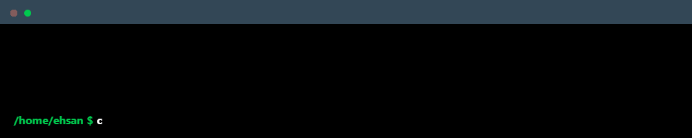

<!-- # 👋 Hi, I'm Ehsan Rafi Anjum!
### Computer Engineering Student | Senior | Aspiring IT Engineer | Passionate About Technology

I'm a Computer Engineering student with a passion for solving real-world problems through code.

### 🔧 Technologies & Tools
- **Languages**: C++, Python, Java, JavaScript, HTML/CSS, SQL
- **Frameworks & Libraries**: React, Node.js, Flask, Django, TensorFlow
- **Tools**: Git, Docker, Kubernetes, Jenkins, AWS
- **Databases**: MySQL, PostgreSQL, MongoDB
- **Others**: Linux, Agile/Scrum, REST APIs, CI/CD

### 📈 GitHub Stats

### 📬 Contact Me
- **Email**: [ehsanrafianjum@gmail.com](mailto:ehsanrafianjum@gmail.com)
- **LinkedIn**: [linkedin.com/in/ehsanrafi](https://linkedin.com/in/ehsanrafi)
- **Personal Website**: [ehsanrafi.github.io](https://ehsanrafi.github.io)
 -->

 

    

<h3 style="text-align: center; font-size: 24px;">Skills</h3>

  
  
  
  
  
  
  
  
  

<h3 style="text-align: center; font-size: 24px;">Contact me!</h3>

    <!-- 
    
    
    
     -->
    
    
    
    <!-- correo
    pag web -->

<!-- /home/ehsan cat whoami.txt

{
    "type": "information",
    "categories": [
        {
            "about": "computer engineering student with a passion for solving real-world problems through code",
            "interests": [
                "backend development",
                "deep learning & ai",
                "machine learning",
                "cybersecurity",
                "data science",
                "databases",
                "devops"
            ]
        }
    ]
} -->